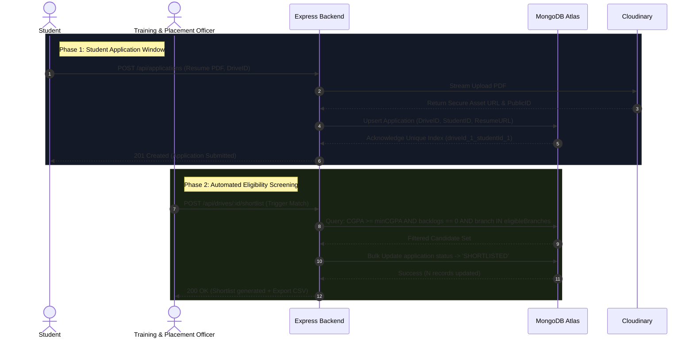

# Data Flow & Execution Pipeline

## Automated Shortlisting & Application Flow

```mermaid
sequenceDiagram
    autonumber
    actor Student
    actor TPO as Training & Placement Officer
    participant API as Express Backend
    participant DB as MongoDB Atlas
    participant Cloud as Cloudinary

    rect rgb(20, 25, 40)
    note right of Student: Phase 1: Student Application Window
    Student->>API: POST /api/applications (Resume PDF, DriveID)
    API->>Cloud: Stream Upload PDF
    Cloud-->>API: Return Secure Asset URL & PublicID
    API->>DB: Upsert Application (DriveID, StudentID, ResumeURL)
    DB-->>API: Acknowledge Unique Index (driveId_1_studentId_1)
    API-->>Student: 201 Created (Application Submitted)
    end

    rect rgb(25, 35, 20)
    note right of TPO: Phase 2: Automated Eligibility Screening
    TPO->>API: POST /api/drives/:id/shortlist (Trigger Match)
    API->>DB: Query: CGPA >= minCGPA AND backlogs == 0 AND branch IN eligibleBranches
    DB-->>API: Filtered Candidate Set
    API->>DB: Bulk Update application status -> 'SHORTLISTED'
    DB-->>API: Success (N records updated)
    API-->>TPO: 200 OK (Shortlist generated + Export CSV)
    end
```